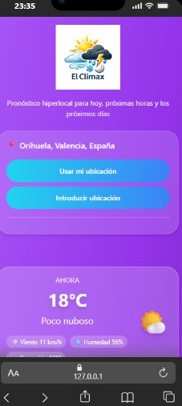
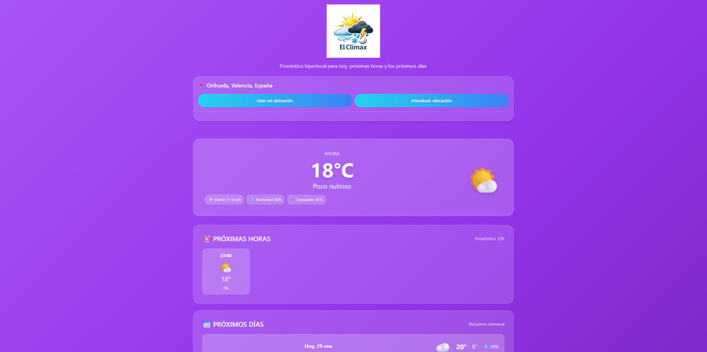

🌤️ El Climax

Aplicación web del clima con pronóstico en tiempo real usando la API de Open-Meteo.

📸 Capturas de Pantalla

Vista Mobile

Vista Desktop

📋 Descripción
El Climax es una aplicación meteorológica responsive optimizada para dispositivos móviles que muestra:

☀️ Clima actual con temperatura, humedad y viento
⏰ Pronóstico de las próximas 12 horas
📅 Pronóstico de los próximos 7 días

🚀 Demo en Vivo
🔗 Ver aplicación en GitHub Pages

🛠️ Tecnologías

TecnologíaUsoHTML5Estructura

semánticaCSS3Estilos y animacionesJavaScript

ES6+Lógica y funcionalidadTailwind CSSFramework de utilidades CSSOpen-Meteo APIDatos meteorológicosLocalStoragePersistencia del historial

📂 Estructura del Proyecto
el-climax/
├── index.html              # Página principal
├── css/
│   ├── styles.css         # Estilos generales
│   ├── header.css         # Estilos del header
│   └── footer.css         # Estilos del footer
├── js/
│   └── script.js          # Lógica de la aplicación
├── images/
│   └── elClimax.png       # Logo
├── screenshots/           # Capturas de pantalla
├── .gitignore
└── README.md

⚙️ Instalación
Opción 1: Clonar y abrir directamente
bash# 1. Clonar el repositorio
git clone https://github.com/javiertunsi7/elTiempo.git
cd el-climax

# 2. Abrir index.html en tu navegador
# O usar Live Server en VS Code
Opción 2: Servidor local
bash# Con Python
python -m http.server 8000

# Con Node.js
npx http-server

# Luego visitar: http://localhost:8000
Requisitos

✅ Navegador moderno (Chrome, Firefox, Safari, Edge)
✅ Conexión a Internet
✅ Permisos de geolocalización (opcional)

🎯 Funcionalidades

🌍 Geolocalización automática: Detecta tu ubicación

🔍 Búsqueda manual: Busca cualquier ciudad del mundo

📍 Historial: Guarda las últimas 5 ubicaciones

🔄 Auto-actualización: Cada 10 minutos

📱 Responsive: Diseño adaptado a móvil, tablet y desktop

📱 Uso

Detectar ubicación automática:

Clic en "Usar mi ubicación"
Permitir acceso a la ubicación

Buscar ciudad manualmente:

Clic en "Introducir ubicación"
Escribir nombre de ciudad
Seleccionar de la lista

Usar historial:

Clic en cualquier ubicación guardada

🌐 API Utilizada
Open-Meteo API - https://open-meteo.com

Geocoding API: Búsqueda de coordenadas

  https://geocoding-api.open-meteo.com/v1/search

Forecast API: Datos meteorológicos

  https://api.open-meteo.com/v1/forecast
Características:

✅ Gratuita y sin API Key
✅ Actualización cada 15 minutos
✅ Cobertura mundial
✅ Datos en tiempo real

🎨 Características de Diseño
Responsive Design

Mobile First: < 640px
Tablet: 640px - 768px
Desktop: > 768px

Efectos Visuales

Glassmorphism (efecto vidrio)
Animaciones CSS suaves
Degradados modernos
Iconos meteorológicos

🔧 Configuración (Opcional)
Cambiar ubicación por defecto
Editar en js/script.js:
javascript// Líneas 1-2
let currentLat = 38.0883;  // Tu latitud
let currentLon = -0.9439;  // Tu longitud
Cambiar intervalo de actualización
javascript// Última línea de script.js
setInterval(() => {
    fetchWeatherData(currentLat, currentLon);
}, 600000); // 600000ms = 10 minutos

🌿 Gestión de Ramas
bash# Estructura de ramas
main          # Producción
├── dev   # Desarrollo
└── feat/* # Nuevas funcionalidades
Workflow
bash# Crear nueva funcionalidad
git checkout -b feature/nueva-funcionalidad
git add .
git commit -m "feat: descripción del cambio"
git push origin feature/nueva-funcionalidad

# Mergear a develop
git checkout develop
git merge feature/nueva-funcionalidad

# Mergear a main (producción)
git checkout main
git merge develop
git push origin main

🤖 Uso de Inteligencia Artificial
Herramienta Utilizada
Claude AI (Anthropic) - https://claude.ai
¿Cómo ayudó la IA?
ÁreaAyuda ProporcionadaHTML✅ Estructura semántica y accesibilidadCSS✅ Diseño responsive y glassmorphismJavaScript✅ Integración con API y manejo de erroresGit✅ Estrategia de ramas y commitsDocumentación✅ Estructura del READMEDebugging✅ Resolución de errores
Lo que la IA NO hizo
❌ Trabajo realizado manualmente:

Diseño visual personalizado y paleta de colores
Lógica específica de búsqueda de ciudades
Sistema de historial con localStorage
Testing en dispositivos reales
Toma de decisiones de diseño

Prompts Utilizados
"Crea una estructura HTML semántica para una app del clima"
"Optimiza este código JavaScript para usar async/await"
"Sugiere mejores prácticas para responsive design mobile-first"
"Ayuda a separar el CSS en componentes (header, footer, main)"

🐛 Solución de Problemas
ProblemaSoluciónGeolocalización no funcionaPermitir permisos en el navegadorCiudad no encontradaVerificar ortografía o usar nombre en inglésEstilos no carganVerificar rutas de archivos CSSDatos no actualizanVerificar conexión a Internet

🔐 Privacidad

✅ No se recopilan datos personales
✅ Ubicación solo para mostrar el clima
✅ Historial guardado localmente (localStorage)
✅ No se envían datos a terceros

📊 Navegadores Compatibles
NavegadorVersión MínimaEstadoChrome90+✅Firefox88+✅Safari14+✅Edge90+✅

👨‍💻 Autor
[Tu Nombre]

GitHub: @javiertunsi7
Email: javiertunsi7@gmail.com
LinkedIn: Javier Galvañ Navarro

⭐ Si te gustó este proyecto, dale una estrella en GitHub!

🚀 Deploy
La aplicación está desplegada en GitHub Pages:
bash# Activar GitHub Pages
# Settings > Pages > Source: main branch > Save
🔗 URL: https://github.com/javiertunsi7/elTiempo.git